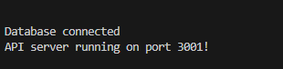
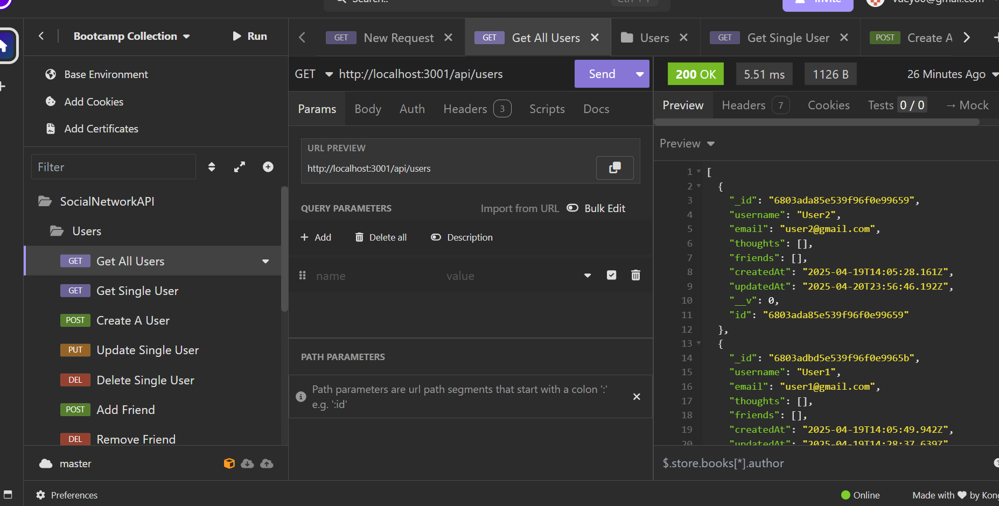
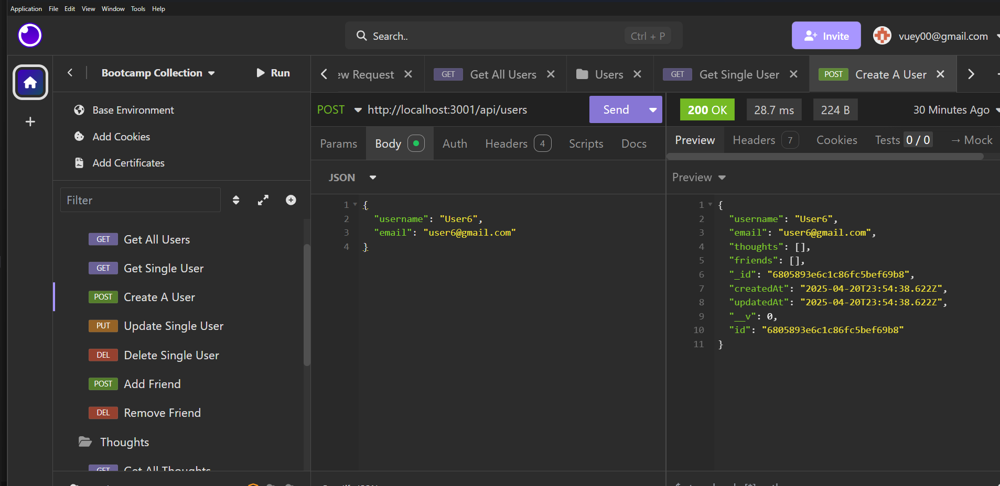
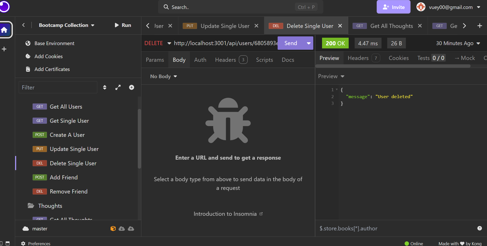
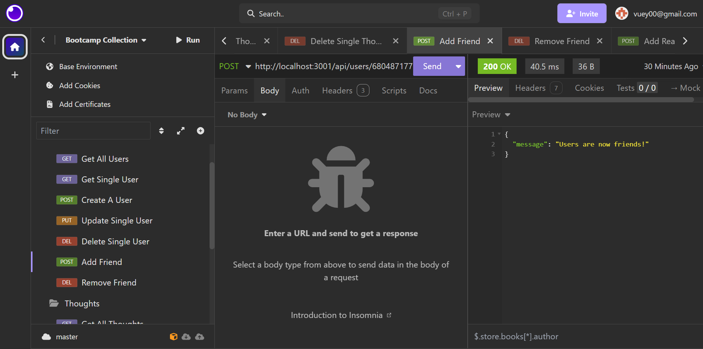
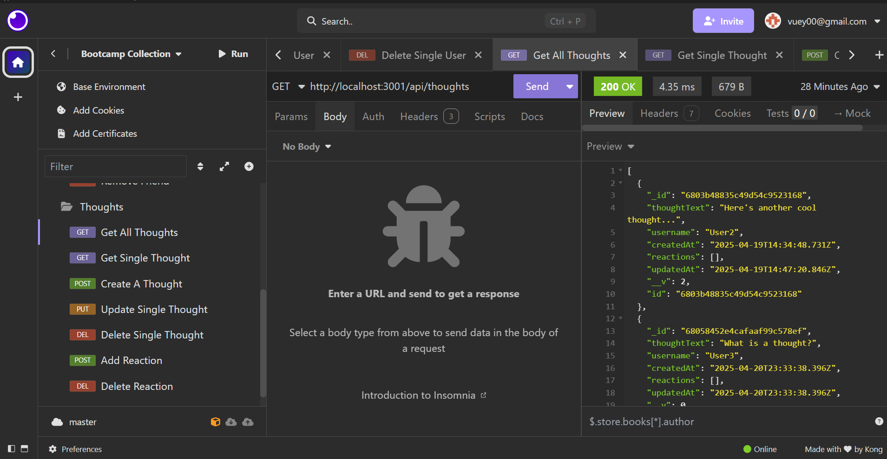
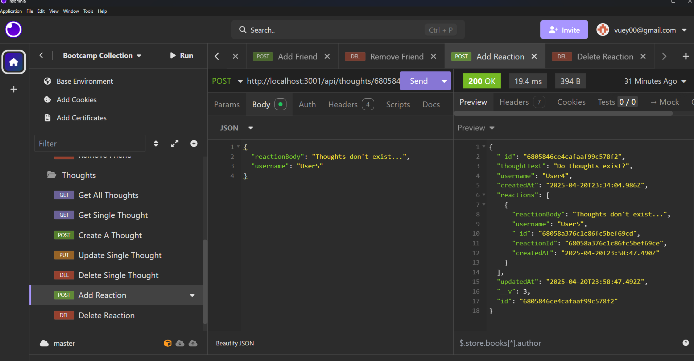

# Social Network API

## Description

This project is a social networking API project. It uses MongoDB as a database and Express.js for routing as well as Mongoose. A custom API was built to create users, grab all or single users, update users and delete users. Users can also friend or defriend each other. Users can have thoughts which these thoughts can all be obtained or singularly. Thoughts can also be updated, deleted and created. Thoughts can also have reactions tagged along with them and reactions removed. Insomnia can be used to simulate these requests. Creating this project it allowed for me to understand APIs better, how to build one from the ground up and use new technologies such as MongoDB and Mongoose. My use and understanding of Express.js has also strengthened.

## Tables of Contents

- [Description](#description)
- [Installation](#installation)
- [Usage](#usage)
- [Credits](#credits)

## Installation

To ensure all packages are installed to properly run the app server, run an "npm i" in the terminal. After doing so, the server can be started with a "npm run start" which will build the app files and launch the server.

## Usage

Here is a link to a walkthrough video of the app in use: [Walkthrough Video](https://drive.google.com/file/d/1m8hQ6NDnP5cv6QuYAPK-KkkwSgdx65cy/view?usp=sharing)

Some screenshots of the app when active:

This is what the terminal should say when the app is launched.

This is what it'll look like in Insomnia when GET users. Only a single user will show if GET single user.

This is what it'll look like and what is needed to create a user.

This is deleting a user.

This is adding a friend.

Thoughts are similar but instead of username and email. Thought use thoughtBody and username.

Reactions call for two thought IDs in the url and a reactionBody in the payload with a username.

## Credits

Below is my GitHub profile. Any suggestions to improve functionality and code, feel free to reach out to me!

GitHub: https://github.com/AVue00

